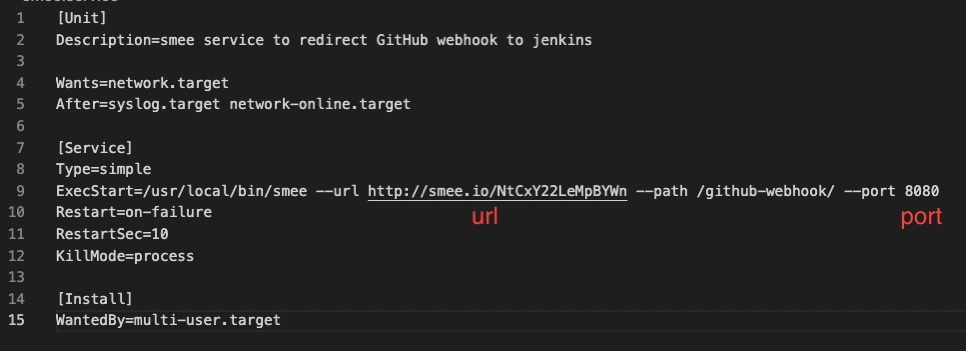

# Server configuration instructions for CI/CD webhooks

In order to make CI/CD webhooks work with firewall it is necessary to create tunnell to proxy server that redirects webhooks.

In order to achieve that, <a href="https://github.com/probot/smee.io">smee</a> has been used. However, in order to work smee requires client running continuously on the server side.

 

## Running smee_client on server

Download and install <a href="https://github.com/probot/smee-client">smee_client</a>. Try it running before proceeding.

Download this repository.

Open smee.service and configure following arguments:
- url: URL of your smee webhook (the same you use in Jenkins or whatever service)
- port: port used by the service webhook is meant for

Unfortunately smee client does not work as a backend service and it stops working with terminal closure. For the convinience (no necessity to keep ssh terminal with smee client running) it is recommended to create systemctl service to run in background:
    
- `sudo chmod +x set_smee_service.sh`

- `sudo ./set_smee_service.sh`

 

### Stopping and disabling service

- `sudo chmod +x remove_smee_service.sh`

- `sudo ./remove_smee_service.sh`

 

## Links:
https://www.howtogeek.com/687970/how-to-run-a-linux-program-at-startup-with-systemd/

https://github.com/probot/smee-client

https://www.jenkins.io/blog/2019/01/07/webhook-firewalls/
